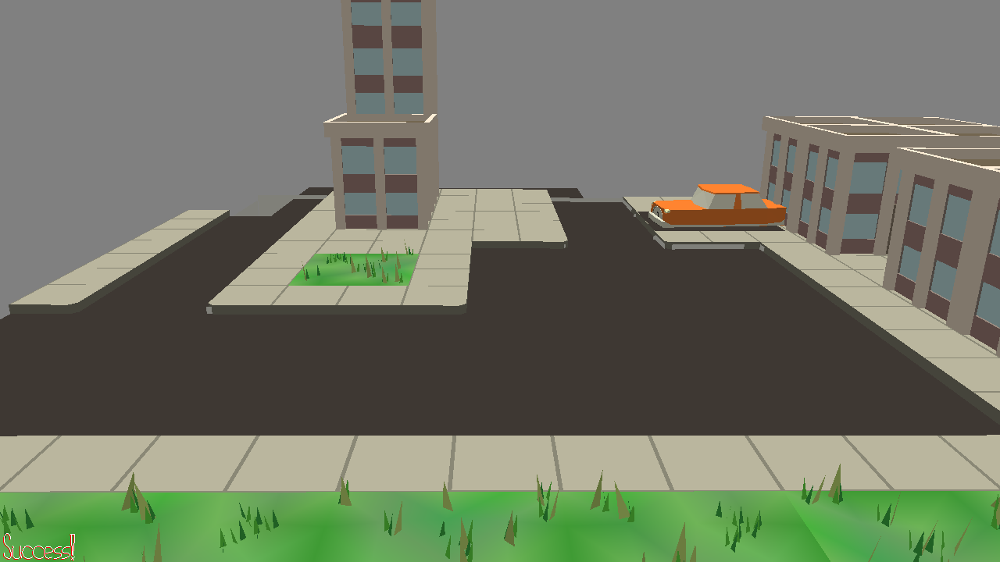

# The monitor parking

Author: Wenlin Mao (wenlinm)

Design: Lets mimic the watch dog and control our car from the monitor. The goal is 
 to park the car in the labeled area. It can be quite chanlleging if 
 park with wrong direction. 

Screen Shot:

How Your Asset Pipeline Works:

For the scene, I modified to adding more than 10 hidden walls along the road so that
all collision can be computed by bounding box. Then I used make to build the 
scene file and copy it to the dist folder

How To Play:

Control the monitor by mouse and wasd for car to move. You can not have car just rotate 
at original point as no real car can do that. For changing direction, 
you need to combine up or down key with left or right key. 

Sources: 

city.blend -- Jim McCann
hexapod.blend -- Jim McCann

This game was built with [NEST](NEST.md).

